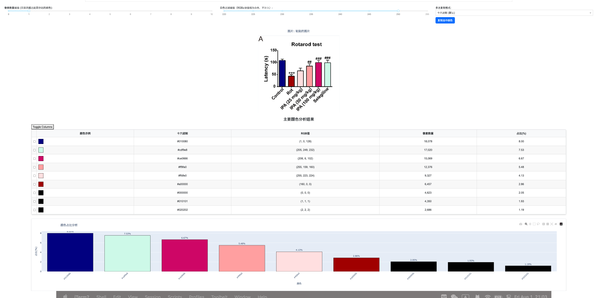

# Abstract
It's a _____DASH_ app for getting the frequencies of colors above a customized threshold.

# Get Started

- Cloning this repository and `cd` into it.

- Install the Dependencies.
```bash
pip install dash pandas plotly pillow numpy dash-bootstrap-components
```

- Runing the app.
```bash
py main.ap
```

- Open `http://127.0.0.1:8050/`

# Example



example picture from :[Microbial metabolite 3-indolepropionic acid alleviated PD pathologies by decreasing enteric glia cell gliosis via suppressing IL-13Rα1 related signaling pathways](10.1016/j.apsb.2025.02.029)
